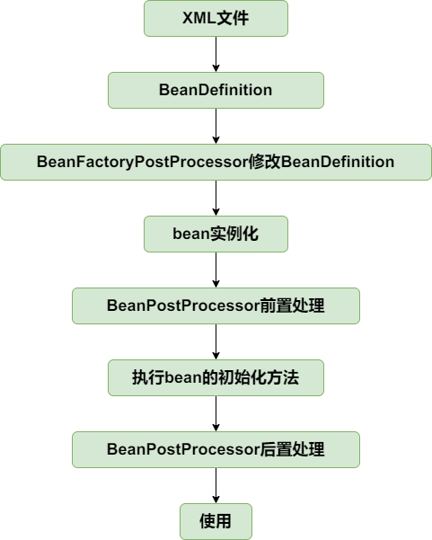

# IOC
## 最简单的Bean容器
> package:simplebeancontainer

定义了一个简单的bena容器，并且只有注册和获取bean的方法。
## BeanDefinition和BeanDefinitionRegistry
> package:beandefinitionandbeandefinitionregisty

主要增加如下类：

- BeanDefinition，顾名思义，用于定义bean信息的类，包含bean的class类型、构造参数、属性值等信息，每个bean对应一个BeanDefinition的实例。简化BeanDefinition仅包含bean的class类型。
- BeanDefinitionRegistry，BeanDefinition注册表接口，定义注册BeanDefinition的方法。
- SingletonBeanRegistry及其实现类DefaultSingletonBeanRegistry，定义添加和获取单例bean的方法。
bean容器作为BeanDefinitionRegistry和SingletonBeanRegistry的实现类，具备两者的能力。向bean容器中注册BeanDefinition后，使用bean时才会实例化。

## Bean实例化策略InstantiationStrategy
> package:instantiationstrategy

之前创建bean的方法是在AbstractAutowireCapableBeanFactory#doCreateBean中用newInstance方法实现的，仅适用于bean有无参构造的情况。
针对bean的实例化，抽象出一个实例化策略的接口InstantiationStrategy，有两个实现类：
- SimpleInstantiationStrategy，使用bean的构造函数来实例化
- CglibSubclassingInstantiationStrategy，使用CGLIB动态生成子类

## 为Bean填充属性
> package:populatebeanwithpropertyvalues

在BeanDefinition中增加bean属性对应的PropertyValues,实例化bean之后，为bean填充属性。
(AbstractAutowireCapableBeanFactory#applyPropertyValues)。

## 为Bean注入Bean
> package:populatebeanwithbean

增加BeanReference类，包装一个bean对另一个bean的引用。实例化beanA后填充属性时，若PropertyValue#value为BeanReference，引用beanB，则先去实例化beanB。 由于不想增加代码的复杂度提高理解难度，暂时不支持循环依赖，后面会解决该问题。

## 资源和资源加载器
> package:resourceandresourceloader

## 在xml文件中定义bean
> package:xmlfiledefinebean

XmlBeanDefinitionReader实现BeanDefinitionReader接口，对xml中的bean信息进行解析

## BeanFactoryPostProcessor和BeanPostProcessor
> package:beanfactorypostprocessorandbeanpostprocessor

BeanFactoryPostProcessor和BeanPostProcessor是spring框架中具有重量级地位的两个接口，理解了这两个接口的作用，基本上就理解spring的核心原理了。

BeanFactoryPostProcessor是spring提供的容器扩展机制，允许我们在bean实例化之前修改bean的定义信息，即BeanDefinition的信息。其重要的实现类有
PropertyPlaceholderConfigurer和CustomEditorConfigurer。
- **PropertyPlaceholderConfigurer**的作用是用properties文件的配置值替换xml文件中的占位符。
- **CustomEditorConfigurer**的作用是实现类型转换  

单元测试类：BeanFactoryPostProcessorAndBeanPostProcessorTest#testBeanFactoryPostProcessor

同时为了适应新的场景以及尽量保持和spring中BeanFactory的继承层次一致，增加了ConfigurableListableBeanFactory，ConfigurableBeanFactory，HierarchicalBeanFactory

BeanPostProcessor也是spring提供的容器扩展机制，不同于BeanFactoryPostProcessor的是BeanPostProcessor是在bean实例化之后修改bean或者
替换bean。BeanPostProcessor是后面实现AOP的关键。

BeanPostProcessor的两个方法分别在bean执行初始化方法（后面实现）之前和之后执行。   
单元测试类：BeanFactoryPostProcessorAndBeanPostProcessorTest#testBeanPostProcessor和AbstractAutowireCapableBeanFactory#initializeBean方法

## 应用上下文ApplicationContext
> package:applicationcontext

应用上下文ApplicationContext是spring中较之于BeanFactory更为先进的IOC容器，ApplicationContext除了拥有BeanFactory的全部功能之外，还
支持特殊类型bean，如上一节中的BeanFactoryBeanPostProcessor和BeanPostProcessor，能对他们进行自动识别，资源加载，容器事件和监听器，国际化
支持、单例bean自动初始化等。

BeanFactory是spring的基础设施，面相spring本省；ApplicationContext面相的是spring的使用者，在一般的应用中都是使用ApplicationContext。

具体实现查看AbstractApplicationContext#refresh方法即可。注意BeanFactoryPostProcessor和BeanPostProcessor的自定识别，这样就可以在xml文件中配置二者而不需要像上一节一样手动添加到容器中了。

从bean的角度看，目前的生命周期如下：

## bean的初始化和销毁方法
> package:initanddestroymethod

在spring中，定义bean的初始化和销毁方法有三种方法：
- 在xml文件中制定init-method和destroy-method
- 继承自InitializingBean和DisposableBean
- 在方法上加注解PostConstruct和PreDestroy

第三种通过BeanPostProcessor实现，在后续实现，本节只实现前两种。

针对第一种在xml文件中指定初始化和销毁方法的方式，在BeanDefinition中增加属性initMethodName和destroyMethodName。  

初始化方法在AbstractAutowireCapableBeanFactory#invokeInitMethods执行。DefaultSingletonBeanRegistry中增加属性disposableBeans
保存拥有销毁方法的bean，拥有销毁方法的bean在AbstractAutowireCapableBeanFactory#registerDisposableBeanIfNecessary中注册到disposableBeans中。

为了确保销毁方法虚拟机关闭之前执行，向虚拟机中注册一个钩子方法，查看AbstractApplicationContext#registerShutdownHook（非web应用需要手动
调用该方法）。当然也可以手动调用ApplicationContext#close方法关闭容器。

到此为止Bean的声明周期如下：

